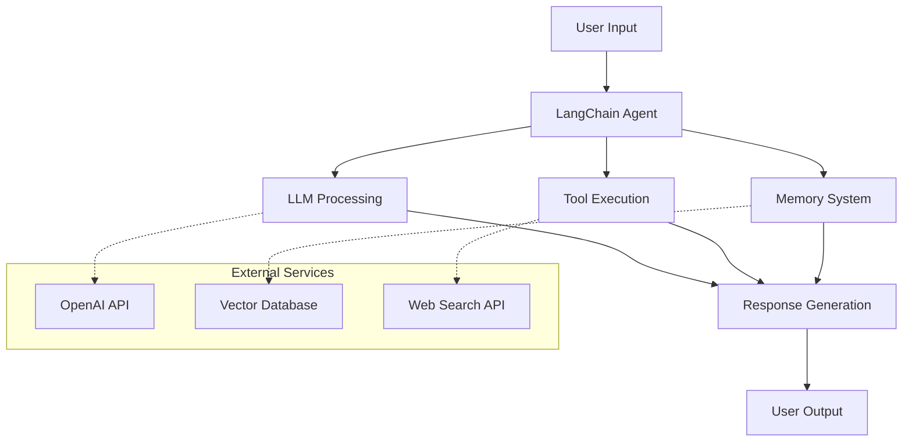
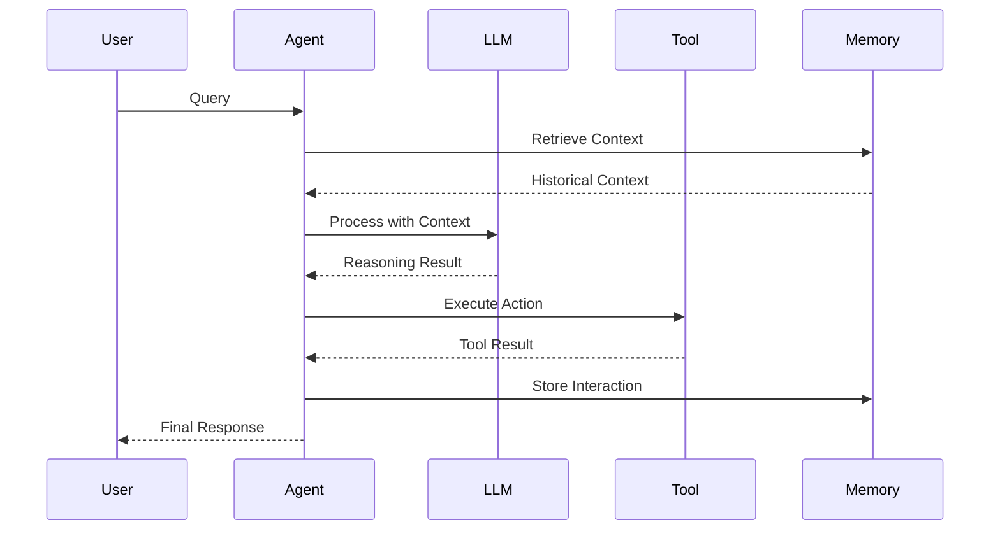
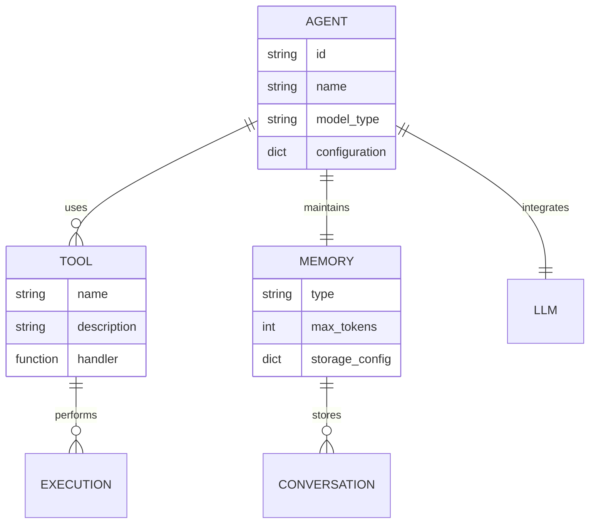
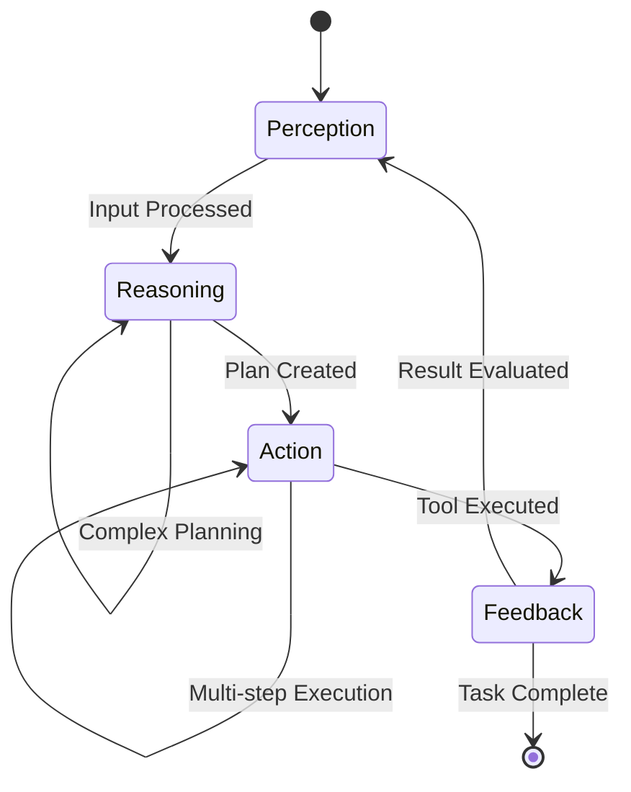
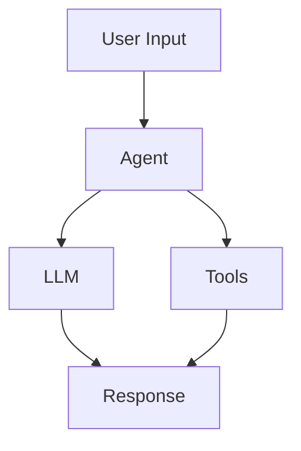

# LangChain in Action: Detailed Authoring Guidelines

## Technical Writing Standards for AI Practitioners

### Core Principles

1. **Practitioner-First Approach:** Every sentence should provide actionable value to developers building AI agents.
2. **Production-Ready Focus:** All code examples must be suitable for production environments.
3. **Architectural Thinking:** Emphasize system design, scalability, and maintainability.
4. **Hands-On Learning:** Theory supports practice, not the reverse.

## Content Structure Requirements

### Chapter Organization (25-30 pages target)

#### Page Allocation Guidelines

- **Introduction:** 2-3 pages (10%)
- **Conceptual Foundation:** 4-5 pages (17%)
- **Hands-On Implementation:** 12-15 pages (50%)
- **Architecture & Patterns:** 3-4 pages (13%)
- **Real-World Application:** 3-4 pages (13%)
- **Exercise & Summary:** 2-3 pages (10%)

#### Implementation Progression Model

Each chapter follows this learning progression:

1. **Problem Context** → Why this matters in production AI systems
2. **Conceptual Foundation** → Essential theory and LangChain architecture
3. **Basic Implementation** → Working code with immediate results
4. **Enhanced Implementation** → Production considerations and best practices
5. **Advanced Integration** → Complex scenarios and optimization
6. **Real-World Application** → Complete use case with business context

### Technical Content Standards

#### Project Organization and File Structure

All chapter materials must be organized according to the following structure:

```
langchain-project/
├── .env                    # Environment variables (don't commit!)
├── .gitignore
├── requirements.txt
├── README.md
├── codes/                  # All chapter code examples
│   ├── chapter01/         # Organized by chapter
│   │   ├── basic_agent.py
│   │   ├── enhanced_agent.py
│   │   └── production_agent.py
│   ├── chapter02/
│   │   ├── modular_chains.py
│   │   └── custom_tools.py
│   └── shared/            # Reusable utilities
│       ├── config.py
│       ├── logging_utils.py
│       └── test_helpers.py
├── notebooks/             # All Jupyter notebooks
│   ├── chapter01/
│   │   ├── 01_first_agent.ipynb
│   │   ├── 02_debugging_demo.ipynb
│   │   └── 03_testing_framework.ipynb
│   ├── chapter02/
│   │   ├── 01_modular_design.ipynb
│   │   └── 02_advanced_chains.ipynb
│   └── exploration/       # Experimental notebooks
├── data/                  # Sample data files
│   ├── raw/
│   └── processed/
├── tests/                 # Unit and integration tests
│   ├── test_chapter01/
│   └── test_chapter02/
└── docs/                  # Additional documentation
    ├── architecture/
    └── troubleshooting/
```

**File Organization Rules:**

1. **Python Code Files**: Store all `.py` files in the `codes/` directory, organized by chapter
2. **Jupyter Notebooks**: Store all `.ipynb` files in the `notebooks/` directory, organized by chapter
3. **Naming Convention**: Use descriptive names with chapter prefixes (e.g., `01_basic_agent.py`, `02_enhanced_agent.py`)
4. **Shared Code**: Place reusable utilities in `codes/shared/` for cross-chapter usage
5. **Documentation**: Include comprehensive README files in each chapter subdirectory

#### Code Quality Checklist

Every code example must include:

- [ ] Complete imports and dependencies
- [ ] Type hints for all functions and classes
- [ ] Comprehensive error handling
- [ ] Structured logging implementation
- [ ] Configuration management
- [ ] Unit test examples
- [ ] Performance considerations
- [ ] Security best practices
- [ ] Proper file organization in `codes/` or `notebooks/` directories

#### Documentation Requirements

```python
def example_function(param: str, config: Dict[str, Any]) -> Dict[str, Any]:
    """
    Brief description of function purpose and use case.

    This function demonstrates [key concept] in the context of
    [LangChain component] integration for [specific use case].

    Args:
        param: Description of parameter and expected format
        config: Configuration dictionary with keys:
            - "api_key": OpenAI API key for model access
            - "model": Model name (default: "gpt-4")
            - "temperature": Sampling temperature (0.0-2.0)

    Returns:
        Dictionary containing:
            - "result": Processed output from the agent
            - "metadata": Execution metrics and debugging info
            - "status": Success/failure indicator

    Raises:
        ValueError: If parameters are invalid or missing
        APIError: If external service calls fail

    Example:
        >>> config = {"api_key": "sk-...", "model": "gpt-4"}
        >>> result = example_function("input text", config)
        >>> print(result["status"])
        "success"
    """
    # Implementation with comprehensive error handling
    pass
```

### Architecture Documentation Standards

#### System Diagrams Requirements

Each chapter must include Mermaid diagrams for visual clarity and consistency. Use Mermaid syntax for all architectural and flow diagrams.

1. **Component Architecture Diagram** (Use Mermaid Flowchart)



- Visual representation of system components
- Data flow indicators with arrows
- Integration points with external services
- Error handling paths and fallbacks

2. **Sequence Diagrams** (Use Mermaid Sequence)



- Request/response flows between components
- Async operation handling patterns
- Error propagation mechanisms
- Resource lifecycle management

3. **Data Model Diagrams** (Use Mermaid Class or ER Diagrams)



- Input/output schemas and relationships
- Configuration structures and dependencies
- State management patterns
- Persistence models and data flow

4. **Agent Flow Diagrams** (Use Mermaid State Diagrams)



**Mermaid Integration Guidelines:**

- Always use Mermaid syntax for consistency across chapters
- Include proper labels and descriptions for clarity
- Use subgraphs to group related components
- Add styling where appropriate for better visual impact
- Test all Mermaid diagrams for proper rendering
- Provide text descriptions alongside visual diagrams

#### Technical Decision Tables

Format for comparing approaches:

```markdown
| Criterion   | Option A  | Option B | Option C | Recommendation                |
| ----------- | --------- | -------- | -------- | ----------------------------- |
| Performance | Excellent | Good     | Fair     | Option A                      |
| Complexity  | High      | Medium   | Low      | Context-dependent             |
| Scalability | Excellent | Good     | Limited  | Option A                      |
| Maintenance | Medium    | High     | Low      | Option B for small scale      |
| Cost        | High      | Medium   | Low      | Option B for budget-conscious |

**Decision Matrix**: Choose Option A for high-performance production systems,
Option B for balanced requirements, Option C for prototyping only.
```

### Implementation Patterns

#### Error Handling Standards

```python
import logging
from typing import Optional, Dict, Any
from contextlib import contextmanager
from enum import Enum

class AgentError(Exception):
    """Base exception for agent-related errors."""
    pass

class ConfigurationError(AgentError):
    """Raised when agent configuration is invalid."""
    pass

class ProcessingError(AgentError):
    """Raised when agent processing fails."""
    pass

@contextmanager
def error_handling_context(operation_name: str):
    """Context manager for consistent error handling."""
    logger = logging.getLogger(__name__)

    try:
        logger.info(f"Starting operation: {operation_name}")
        yield
        logger.info(f"Completed operation: {operation_name}")
    except ConfigurationError as e:
        logger.error(f"Configuration error in {operation_name}: {e}")
        raise
    except ProcessingError as e:
        logger.error(f"Processing error in {operation_name}: {e}")
        raise
    except Exception as e:
        logger.error(f"Unexpected error in {operation_name}: {e}")
        raise ProcessingError(f"Operation {operation_name} failed: {e}")

# Usage example
def process_agent_request(request_data: Dict[str, Any]) -> Dict[str, Any]:
    """Process agent request with comprehensive error handling."""
    with error_handling_context("agent_request_processing"):
        # Implementation here
        return {"status": "success", "result": "processed_data"}
```

#### Configuration Management Pattern

```python
from dataclasses import dataclass, field
from typing import Optional, List, Dict, Any
import os
from pathlib import Path

@dataclass
class LangChainAgentConfig:
    """Production configuration for LangChain agents."""

    # Model Configuration
    model_name: str = "gpt-4"
    api_key: str = field(default_factory=lambda: os.getenv("OPENAI_API_KEY", ""))
    temperature: float = 0.7
    max_tokens: int = 4096

    # Vector Store Configuration
    vector_store_type: str = "pinecone"  # pinecone, faiss, chroma
    vector_store_config: Dict[str, Any] = field(default_factory=dict)

    # Memory Configuration
    memory_type: str = "buffer"  # buffer, summary, token_buffer
    memory_key: str = "chat_history"
    max_memory_tokens: int = 2000

    # Tool Configuration
    enabled_tools: List[str] = field(default_factory=list)
    tool_timeout: int = 30

    # Monitoring Configuration
    enable_tracing: bool = True
    log_level: str = "INFO"
    metrics_enabled: bool = True

    def __post_init__(self):
        """Validate configuration after initialization."""
        self._validate_model_config()
        self._validate_vector_config()
        self._validate_memory_config()

    def _validate_model_config(self) -> None:
        """Validate model-related configuration."""
        if not self.api_key:
            raise ConfigurationError("API key is required")

        if not 0 <= self.temperature <= 2:
            raise ConfigurationError("Temperature must be between 0 and 2")

        if self.max_tokens <= 0:
            raise ConfigurationError("Max tokens must be positive")

    def _validate_vector_config(self) -> None:
        """Validate vector store configuration."""
        valid_stores = ["pinecone", "faiss", "chroma"]
        if self.vector_store_type not in valid_stores:
            raise ConfigurationError(f"Vector store must be one of: {valid_stores}")

    def _validate_memory_config(self) -> None:
        """Validate memory configuration."""
        valid_memory_types = ["buffer", "summary", "token_buffer"]
        if self.memory_type not in valid_memory_types:
            raise ConfigurationError(f"Memory type must be one of: {valid_memory_types}")

    @classmethod
    def from_file(cls, config_path: Path) -> "LangChainAgentConfig":
        """Load configuration from file."""
        # Implementation for file-based configuration
        pass

    def to_dict(self) -> Dict[str, Any]:
        """Convert configuration to dictionary."""
        return {
            "model_name": self.model_name,
            "temperature": self.temperature,
            "max_tokens": self.max_tokens,
            "vector_store_type": self.vector_store_type,
            "memory_type": self.memory_type,
            "enabled_tools": self.enabled_tools,
            "enable_tracing": self.enable_tracing
        }
```

### Testing and Validation Standards

#### Unit Test Requirements

Every implementation must include corresponding tests:

```python
import pytest
from unittest.mock import Mock, patch
from your_module import LangChainAgent, LangChainAgentConfig

class TestLangChainAgent:
    """Comprehensive test suite for LangChain agent implementation."""

    @pytest.fixture
    def mock_config(self):
        """Provide mock configuration for testing."""
        return LangChainAgentConfig(
            model_name="gpt-3.5-turbo",
            api_key="test-key",
            temperature=0.5
        )

    @pytest.fixture
    def agent(self, mock_config):
        """Provide configured agent instance."""
        return LangChainAgent(mock_config)

    def test_agent_initialization(self, mock_config):
        """Test agent initializes with valid configuration."""
        agent = LangChainAgent(mock_config)
        assert agent.config == mock_config
        assert agent.is_initialized

    def test_invalid_configuration_raises_error(self):
        """Test that invalid configuration raises appropriate error."""
        with pytest.raises(ConfigurationError):
            invalid_config = LangChainAgentConfig(api_key="")
            LangChainAgent(invalid_config)

    @patch('your_module.openai_client')
    def test_process_request_success(self, mock_client, agent):
        """Test successful request processing."""
        # Mock successful API response
        mock_client.create.return_value = Mock(
            choices=[Mock(message=Mock(content="Test response"))]
        )

        result = agent.process_request("Test input")

        assert result["status"] == "success"
        assert "response" in result
        mock_client.create.assert_called_once()

    @patch('your_module.openai_client')
    def test_process_request_failure(self, mock_client, agent):
        """Test request processing with API failure."""
        # Mock API failure
        mock_client.create.side_effect = Exception("API Error")

        with pytest.raises(ProcessingError):
            agent.process_request("Test input")

    def test_configuration_validation(self):
        """Test configuration validation methods."""
        # Test valid configuration
        config = LangChainAgentConfig(
            api_key="test-key",
            temperature=0.7,
            max_tokens=2000
        )
        # Should not raise any exception
        config._validate_model_config()

        # Test invalid temperature
        config.temperature = 3.0
        with pytest.raises(ConfigurationError):
            config._validate_model_config()
```

### Performance and Monitoring Standards

#### Logging Configuration

```python
import logging
import sys
from typing import Optional
from datetime import datetime

def setup_production_logging(
    log_level: str = "INFO",
    log_file: Optional[str] = None,
    structured: bool = True
) -> logging.Logger:
    """
    Configure production-ready logging for LangChain applications.

    Args:
        log_level: Logging level (DEBUG, INFO, WARNING, ERROR, CRITICAL)
        log_file: Optional file path for log output
        structured: Whether to use structured logging format

    Returns:
        Configured logger instance
    """
    logger = logging.getLogger("langchain_agent")
    logger.setLevel(getattr(logging, log_level.upper()))

    # Clear existing handlers
    logger.handlers.clear()

    # Configure formatter
    if structured:
        formatter = logging.Formatter(
            '{"timestamp": "%(asctime)s", "level": "%(levelname)s", '
            '"module": "%(name)s", "message": "%(message)s", '
            '"line": %(lineno)d}'
        )
    else:
        formatter = logging.Formatter(
            '%(asctime)s - %(name)s - %(levelname)s - %(message)s'
        )

    # Console handler
    console_handler = logging.StreamHandler(sys.stdout)
    console_handler.setFormatter(formatter)
    logger.addHandler(console_handler)

    # File handler (if specified)
    if log_file:
        file_handler = logging.FileHandler(log_file)
        file_handler.setFormatter(formatter)
        logger.addHandler(file_handler)

    return logger

# Usage in agent implementations
logger = setup_production_logging("INFO", structured=True)
```

#### Performance Monitoring

```python
import time
import functools
from typing import Callable, Any, Dict
import logging

def monitor_performance(
    operation_name: str,
    log_threshold_seconds: float = 1.0
) -> Callable:
    """
    Decorator to monitor function performance and log slow operations.

    Args:
        operation_name: Human-readable name for the operation
        log_threshold_seconds: Log warning if execution exceeds this time

    Returns:
        Decorated function with performance monitoring
    """
    def decorator(func: Callable) -> Callable:
        @functools.wraps(func)
        def wrapper(*args, **kwargs) -> Any:
            start_time = time.time()
            logger = logging.getLogger(__name__)

            try:
                result = func(*args, **kwargs)
                execution_time = time.time() - start_time

                if execution_time > log_threshold_seconds:
                    logger.warning(
                        f"Slow operation detected: {operation_name} "
                        f"took {execution_time:.2f} seconds"
                    )
                else:
                    logger.debug(
                        f"Operation {operation_name} completed "
                        f"in {execution_time:.2f} seconds"
                    )

                return result

            except Exception as e:
                execution_time = time.time() - start_time
                logger.error(
                    f"Operation {operation_name} failed after "
                    f"{execution_time:.2f} seconds: {e}"
                )
                raise
        return wrapper
    return decorator

# Usage example
@monitor_performance("langchain_agent_processing", log_threshold_seconds=2.0)
def process_agent_request(request_data: Dict[str, Any]) -> Dict[str, Any]:
    """Process agent request with performance monitoring."""
    # Implementation here
    return {"status": "success"}
```

### Jupyter Notebook Standards

All notebooks must be stored in the `notebooks/` directory and follow these standards:

#### Notebook Organization

```
notebooks/
├── chapter01/
│   ├── 01_first_agent.ipynb           # Sequential numbering
│   ├── 02_debugging_demo.ipynb        # Descriptive names
│   └── 03_testing_framework.ipynb     # Clear purpose
├── chapter02/
│   ├── 01_modular_design.ipynb
│   └── 02_advanced_chains.ipynb
└── exploration/                       # Experimental work
    ├── prototype_ideas.ipynb
    └── performance_tests.ipynb
```

#### Notebook Structure Standards

Each notebook must include the following structure:

1. **Header Cell** (Markdown)

```markdown
# Chapter X: [Notebook Title]

**Purpose:** Brief description of what this notebook demonstrates
**Prerequisites:** List of required setup or previous notebooks
**Duration:** Estimated completion time
**Key Concepts:** Main learning objectives

---
```

2. **Setup Cell** (Python)

```python
# Import required libraries and configure environment
import sys
import warnings
warnings.filterwarnings('ignore')

# Add project paths
sys.path.append('../../codes/shared')
sys.path.append('../../codes/chapter01')

# Standard LangChain imports
from langchain_openai import ChatOpenAI
from langchain.chains import ConversationChain
from langchain.memory import ConversationBufferMemory

# Load environment variables
from dotenv import load_dotenv
load_dotenv()

print("✅ Environment setup complete")
```

3. **Learning Sections** with:

   - Clear markdown explanations
   - Progressive code examples
   - Output demonstrations
   - Interactive exercises

4. **Summary Cell** (Markdown)

```markdown
## Summary

**What We Learned:**

- Key concept 1
- Key concept 2
- Key concept 3

**Next Steps:**

- Link to next notebook or chapter
- Suggested experiments
- Additional resources

---
```

#### Notebook Quality Standards

- [ ] All cells execute without errors
- [ ] Clear markdown documentation between code sections
- [ ] Progressive complexity from basic to advanced
- [ ] Interactive elements where appropriate
- [ ] Proper error handling in code cells
- [ ] Output cells cleared before committing (except demonstration outputs)
- [ ] Mermaid diagrams embedded where helpful for visualization
- [ ] Links to corresponding Python files in `codes/` directory

#### Notebook Content Guidelines

```python
# Example of well-documented notebook cell
"""
## Building Our First Agent

This section demonstrates how to create a basic LangChain agent with:
1. Tool integration
2. Memory management
3. Error handling

The code below creates a production-ready agent that can be extended.
"""

from codes.chapter01.basic_agent import create_basic_agent
from codes.shared.config import LangChainConfig

# Configure the agent with production settings
config = LangChainConfig()
agent = create_basic_agent(config)

# Test the agent with a sample query
response = agent.invoke({"input": "What is 25 * 4?"})
print(f"Agent Response: {response['output']}")
```

#### Mermaid Integration in Notebooks

Include Mermaid diagrams in notebooks using markdown cells:

````markdown
## Agent Architecture Overview


````

This diagram shows the basic flow of our agent system.

```

### Quality Assurance Checklist

Before submitting any chapter, verify:

#### Technical Accuracy

- [ ] All code examples are tested and functional
- [ ] Dependencies and versions are specified
- [ ] Error handling covers realistic failure scenarios
- [ ] Configuration examples are production-appropriate
- [ ] Performance implications are documented
- [ ] All Python code files are properly organized in `codes/` directory
- [ ] All Jupyter notebooks are properly organized in `notebooks/` directory

#### Educational Value

- [ ] Learning objectives are specific and measurable
- [ ] Progression from basic to advanced is clear
- [ ] Real-world applications are relevant and practical
- [ ] Exercises provide hands-on reinforcement
- [ ] Troubleshooting guidance is comprehensive
- [ ] Notebooks follow the prescribed structure and standards
- [ ] Interactive elements enhance learning experience

#### Professional Standards

- [ ] Writing tone is professional and authoritative
- [ ] Technical terminology is used accurately
- [ ] Code follows Python best practices and PEP 8
- [ ] Documentation is comprehensive and helpful
- [ ] References and resources are current and valuable
- [ ] Mermaid diagrams are used consistently for visual clarity
- [ ] File organization follows project structure guidelines

#### Visual and Structural Standards

- [ ] Mermaid diagrams are properly formatted and render correctly
- [ ] Architecture diagrams clearly show component relationships
- [ ] Sequence diagrams accurately represent interaction flows
- [ ] All diagrams include proper labels and descriptions
- [ ] Notebook cells are well-organized with clear markdown documentation
- [ ] Code examples reference appropriate files in `codes/` directory

### Chapter Deliverables Summary

Each chapter must include:

1. **Code Files** (in `codes/chapterXX/`):
   - `basic_*.py` - Simple implementations
   - `enhanced_*.py` - Production-ready versions
   - `production_*.py` - Enterprise-grade examples
   - `utils.py` - Chapter-specific utilities

2. **Jupyter Notebooks** (in `notebooks/chapterXX/`):
   - Numbered sequence (01_, 02_, 03_)
   - Interactive demonstrations
   - Step-by-step tutorials
   - Hands-on exercises

3. **Documentation**:
   - Mermaid diagrams for all architectures
   - Comprehensive README files
   - API documentation for custom components
   - Troubleshooting guides

4. **Testing**:
   - Unit tests for all code examples
   - Integration tests for complete workflows
   - Performance benchmarks
   - Validation scripts

This comprehensive approach ensures that every chapter delivers maximum practical value to AI practitioners building production LangChain applications, with proper organization, visual clarity through Mermaid diagrams, and hands-on learning through well-structured notebooks.

---
```
