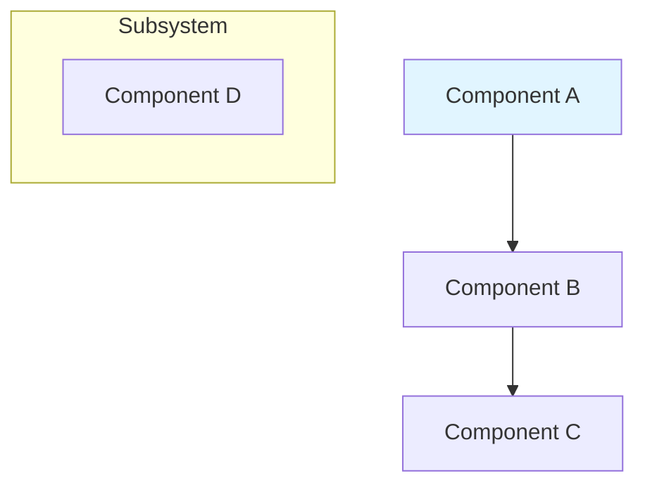
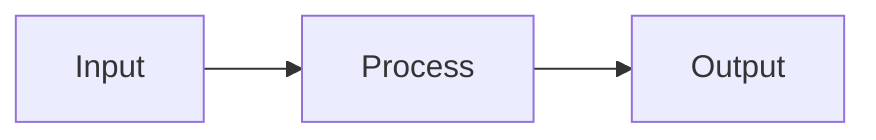
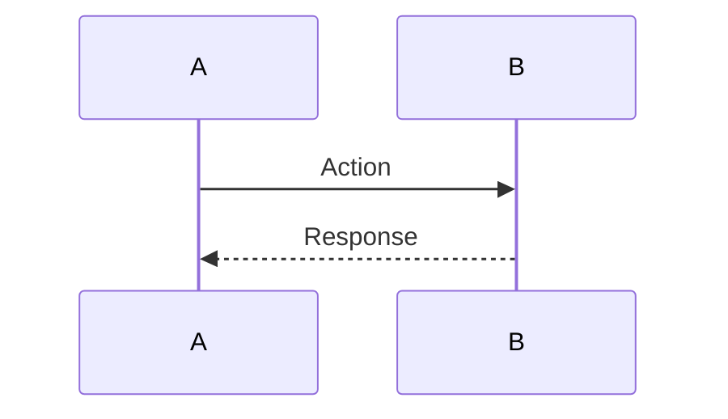
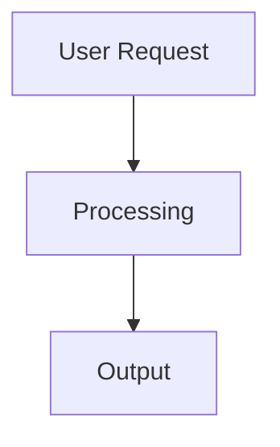

# Chapter [X]: [Chapter Title] - Generation Template

## Quick Start

Copy and customize this template for each chapter you need to generate.

---

## Chapter Information

**Chapter Number**: [X]  
**Chapter Title**: [Full Chapter Title]  
**Part**: [Part Number and Name]  
**Page Target**: 25-30 pages

**Main Topics** (from outline):
1. [Topic 1]
2. [Topic 2]
3. [Topic 3]
4. [Topic 4]
5. [Topic 5]

---

## Step 1: RAG Research Queries

Execute these queries using `mcp_local-rag_query_documents` before writing:

### Core Concepts (3-4 queries)
```
1. "[main chapter topic] fundamentals definition"
2. "[key component] architecture LangChain"
3. "[primary pattern] design principles"
4. "[core feature] overview documentation"
```

### Implementation Patterns (3-4 queries)
```
5. "[component] implementation examples code"
6. "[feature] step by step tutorial"
7. "[integration] usage patterns"
8. "[API] code examples"
```

### Best Practices (2-3 queries)
```
9. "[topic] best practices production"
10. "[component] optimization techniques"
11. "[feature] error handling patterns"
```

### Advanced Topics (1-2 queries)
```
12. "[advanced feature] implementation"
13. "[complex pattern] architecture"
```

**Total Queries**: Minimum 10, recommended 12-15

---

## Step 2: Humanization

Select top 3-5 most relevant excerpts from query results and humanize:

```
mcp_local-rag_humanize_text(
    text="[excerpt 1]",
    preserveCase=false,
    addVariation=true
)

mcp_local-rag_humanize_text(
    text="[excerpt 2]",
    preserveCase=false,
    addVariation=true
)

mcp_local-rag_humanize_text(
    text="[excerpt 3]",
    preserveCase=false,
    addVariation=true
)
```

---

## Step 3: Content Generation

### Section 1: Introduction (2-3 pages)

**Real-World Connection**:
- Industry problem this chapter solves
- Business value proposition
- Why practitioners need these skills

**Technical Relevance**:
- How this builds on previous chapters
- Where this fits in LangChain ecosystem
- Preview of what readers will build

**Key Points to Cover**:
- [ ] Connect to real-world AI agent challenges
- [ ] Establish business value
- [ ] Preview practical outcomes
- [ ] Link to Chapter [X-1] concepts

---

### Section 2: What You Will Learn (0.5 pages)

```markdown
By the end of this chapter, you will be able to:

- [Specific skill 1 with measurable outcome]
- [Specific skill 2 with measurable outcome]
- [Specific skill 3 with measurable outcome]
- [Specific skill 4 with measurable outcome]
- [Specific skill 5 with measurable outcome]
- [Specific skill 6 with measurable outcome]
```

**Checklist**:
- [ ] 5-6 learning outcomes listed
- [ ] Each outcome is specific and measurable
- [ ] Outcomes progress from basic to advanced
- [ ] Technical skills clearly stated

---

### Section 3: Understanding the Concepts (4-5 pages)

**Core Theoretical Foundations** (from RAG queries):
- Concept 1: [definition from documentation]
- Concept 2: [definition from documentation]
- Concept 3: [definition from documentation]

**LangChain Architecture Components**:
- Component A: [role, purpose, integration points]
- Component B: [role, purpose, integration points]
- Component C: [role, purpose, integration points]

**Design Patterns and Principles**:
- Pattern 1: [when to use, benefits, trade-offs]
- Pattern 2: [when to use, benefits, trade-offs]

**Enhanced Learning Elements** (use 3-4 in this section):
```markdown
> **DEFINITION - [Term]**: [Clear, concise definition]

> **IMPORTANT**: [Critical information readers must know]

> **THINGS TO REMEMBER**:
> - [Key point 1]
> - [Key point 2]
> - [Key point 3]
```

**Diagrams** (include 1-2):
- Component architecture diagram (Mermaid flowchart)
- Relationship diagram showing how concepts connect

**Checklist**:
- [ ] All definitions grounded in RAG results
- [ ] Official LangChain terminology used
- [ ] 3-4 enhanced learning elements included
- [ ] 1-2 Mermaid diagrams with captions
- [ ] Clear progression from basic to advanced

---

### Section 4: Hands-On Implementation (12-15 pages)

#### 4a. Basic Implementation (4-5 pages)

**Code File**: `codes/chapter[XX]/01_basic_[topic].py`

**Step 1: Setup and Imports**
```python
# Brief description
from langchain.module import Component
# ... (based on RAG-retrieved examples)
```

**Step 2: Core Component**
```python
# Demonstrate core functionality
# ... (based on official patterns)
```

**Step 3: Basic Usage**
```python
# Simple example
# ... (from documentation)
```

**Enhanced Learning Elements** (use 2-3):
```markdown
> **TIP**: [Practical advice for this section]

> **DEFINITION - [Component]**: [What it does]
```

**Checklist**:
- [ ] Code based on RAG-retrieved official examples
- [ ] Progressive complexity (simple → working)
- [ ] Inline comments explain key concepts
- [ ] 2-3 code snippets with explanations
- [ ] Each snippet 10-20 lines

#### 4b. Enhanced Implementation (4-5 pages)

**Code File**: `codes/chapter[XX]/02_enhanced_[topic].py`

**Enhancements to Add**:
- Configuration management (Pydantic models)
- Error handling (try/except with specific errors)
- Logging (structured logging)
- Type hints and validation
- Production-ready patterns

**Key Code Sections**:
1. Configuration class
2. Error handling wrapper
3. Logging setup
4. Enhanced main implementation

**Enhanced Learning Elements** (use 3-4):
```markdown
> **BEST PRACTICE**: [Production-ready approach]

> **WARNING**: [Common mistake to avoid]

> **PERFORMANCE NOTE**: [Optimization insight]
```

**Checklist**:
- [ ] Error handling demonstrated
- [ ] Configuration with Pydantic
- [ ] Logging integrated
- [ ] Type safety shown
- [ ] 3-4 code snippets

#### 4c. Advanced Patterns (4-5 pages)

**Code File**: `codes/chapter[XX]/03_advanced_[topic].py`

**Advanced Techniques**:
- Complex integrations
- Scalability patterns
- Optimization strategies
- Advanced features from docs

**Key Examples**:
1. Multi-component integration
2. Performance optimization
3. Advanced configuration
4. Production deployment pattern

**Enhanced Learning Elements** (use 2-3):
```markdown
> **EXPERT INSIGHT**: [Industry wisdom]

> **REAL-WORLD EXAMPLE**: [Practical application]

> **SECURITY CONSIDERATION**: [Safety guidance]
```

**Checklist**:
- [ ] Complex scenarios demonstrated
- [ ] Integration patterns shown
- [ ] Scalability addressed
- [ ] Advanced features from RAG docs
- [ ] 2-3 code snippets

---

### Section 5: Architecture and Design Patterns (3-4 pages)

**System Architecture Diagram** (Mermaid):


**Figure Caption**: `**Figure [X.1]: [Descriptive Architecture Title]**`

**Data Flow Diagram** (Mermaid):


**Figure Caption**: `**Figure [X.2]: [Data Flow Description]**`

**Sequence Diagram** (Mermaid):


**Figure Caption**: `**Figure [X.3]: [Sequence Flow Description]**`

**Design Decision Table**:
```markdown
| Criterion   | Option A | Option B | Option C | Recommendation |
| ----------- | -------- | -------- | -------- | -------------- |
| Performance | High     | Medium   | Low      | Use Option A   |
| Complexity  | High     | Medium   | Low      | Context-based  |
| Scalability | High     | Medium   | Low      | Use Option A   |

**Table [X.1]: [Comparison Description]**
```

**Checklist**:
- [ ] 2-3 Mermaid diagrams included
- [ ] All diagrams have captions
- [ ] 1 comparison table with caption
- [ ] Architecture shows component interactions
- [ ] Design patterns from RAG docs

---

### Section 6: Best Practices (2-3 pages)

Format as actionable guidelines with code snippets:

**1. [Best Practice Category 1]**
```python
# Example code demonstrating best practice
```

> **BEST PRACTICE**: [Specific recommendation]

**2. [Best Practice Category 2]**
```python
# Example code
```

> **BEST PRACTICE**: [Specific recommendation]

**Categories to Cover**:
- Performance optimization
- Security implementation
- Scalability design
- Monitoring and observability
- Error handling strategies
- Testing approaches

**Checklist**:
- [ ] 6-8 best practices listed
- [ ] Each has code example
- [ ] Grounded in RAG-retrieved docs
- [ ] Actionable and specific
- [ ] 3-4 BEST PRACTICE blockquotes

---

### Section 7: Common Pitfalls (2-3 pages)

Format as problem-solution pairs:

**Pitfall 1: [Specific Problem]**
- **Issue**: [What goes wrong]
- **Symptoms**: [How to identify it]
- **Solution**: 
  ```python
  # Corrected code
  ```
- **Prevention**: [Design pattern to avoid]

**Pitfall 2: [Specific Problem]**
- **Issue**: [What goes wrong]
- **Symptoms**: [How to identify it]
- **Solution**: 
  ```python
  # Corrected code
  ```
- **Prevention**: [Design pattern to avoid]

**Enhanced Learning Elements**:
```markdown
> **WARNING**: [Critical warning about pitfall]

> **TIP**: [How to debug this issue]
```

**Checklist**:
- [ ] 4-6 common pitfalls covered
- [ ] Each has clear symptoms
- [ ] Solutions include code
- [ ] Prevention strategies included
- [ ] 2-3 WARNING or TIP blockquotes

---

### Section 8: Real-World Application (3-4 pages)

**Use Case**: [Specific Industry Application]

**Business Context**:
- Problem statement
- Requirements
- Success criteria

**Technical Architecture**:


**Figure Caption**: `**Figure [X.4]: [Application Architecture]**`

**Implementation Highlights**:

**Key Code Snippet 1**:
```python
# Critical implementation detail
```

**Key Code Snippet 2**:
```python
# Integration pattern
```

**Results and Metrics**:
```markdown
| Metric          | Before | After | Improvement |
| --------------- | ------ | ----- | ----------- |
| [Metric 1]      | [val]  | [val] | [%]         |
| [Metric 2]      | [val]  | [val] | [%]         |

**Table [X.2]: [Performance Metrics Description]**
```

**Enhanced Learning Elements**:
```markdown
> **REAL-WORLD EXAMPLE**: [How this is used in industry]

> **BEST PRACTICE**: [Key lesson from this application]
```

**Checklist**:
- [ ] Real industry use case
- [ ] Complete architecture shown
- [ ] Key code snippets included
- [ ] Performance metrics provided
- [ ] Deployment considerations noted
- [ ] 1-2 blockquotes included

---

### Section 9: Implementation Exercise (2-3 pages)

**Project Title**: [Descriptive Exercise Name]

**Objective**: [What practitioners will build]

**Prerequisites**:
- [ ] Completed Chapter [X-1] exercises
- [ ] Installed packages: [list]
- [ ] API keys configured: [list]

**Requirements**:
1. [Requirement 1]
2. [Requirement 2]
3. [Requirement 3]
4. [Requirement 4]

**Step-by-Step Guide**:

**Step 1: [Setup]**
```python
# Setup code
```

**Step 2: [Core Implementation]**
```python
# Core code
```

**Step 3: [Enhancement]**
```python
# Enhancement code
```

**Step 4: [Testing]**
```python
# Test code
```

**Validation**:
- [ ] [Test 1 passes]
- [ ] [Test 2 passes]
- [ ] [Test 3 passes]

**Extension Challenges** (for advanced practitioners):
1. [Challenge 1]
2. [Challenge 2]
3. [Challenge 3]

**Enhanced Learning Elements**:
```markdown
> **TIP**: [Helpful hint for exercise]

> **IMPORTANT**: [Critical step not to miss]
```

**Checklist**:
- [ ] Clear objective stated
- [ ] Prerequisites listed
- [ ] Step-by-step instructions
- [ ] Code snippets for each step
- [ ] Validation criteria
- [ ] Extension challenges
- [ ] 2-3 blockquotes

---

### Section 10: Summary (1 page)

**Key Technical Achievements**:
- [What readers accomplished]
- [Skills gained]
- [Concepts mastered]

**Practical Skills Gained**:
- [Skill 1]
- [Skill 2]
- [Skill 3]

**Connection to Next Chapter**:
[How this chapter connects to Chapter [X+1]]

**Additional Learning Resources**:
- [Resource 1]
- [Resource 2]
- [Resource 3]

**Checklist**:
- [ ] Summarizes key achievements
- [ ] Lists practical skills
- [ ] Connects to next chapter
- [ ] Provides additional resources

---

### Section 11: Technical References (0.5 pages)

**LangChain Documentation**:
- [Link to official docs topic 1]
- [Link to official docs topic 2]
- [Link to official docs topic 3]

**Python Packages**:
- `langchain==0.x.x` - [Purpose]
- `package-name==x.x.x` - [Purpose]

**Academic Papers** (if applicable):
- [Paper citation]

**Community Resources**:
- [GitHub repo or example]
- [Tutorial or guide]

**Checklist**:
- [ ] Official LangChain docs linked
- [ ] Package versions specified
- [ ] Community resources included

---

## Step 4: Final Validation

### Content Quality Checklist

**RAG Integration**:
- [ ] Minimum 10 RAG queries executed
- [ ] Top 3-5 excerpts humanized
- [ ] All technical content grounded in docs
- [ ] Code examples based on official patterns
- [ ] API usage verified against docs

**Structure Compliance**:
- [ ] 11 sections in prescribed order
- [ ] Page count: 25-30 pages
- [ ] Section distribution: 10%, 17%, 50%, 13%, 10%

**Enhanced Learning Elements**:
- [ ] TIPS: 8-12 instances
- [ ] IMPORTANT: 4-6 instances
- [ ] THINGS TO REMEMBER: 2-3 instances
- [ ] DEFINITIONS: 5-8 instances
- [ ] EXPERT INSIGHTS: 1-2 instances
- [ ] WARNINGS: 2-4 instances
- [ ] BEST PRACTICES: 6-10 instances
- [ ] REAL-WORLD EXAMPLES: 3-5 instances
- [ ] PERFORMANCE NOTES: 2-4 instances
- [ ] SECURITY CONSIDERATIONS: 2-3 instances

**Visual Elements**:
- [ ] 3-4 Mermaid diagrams
- [ ] All diagrams have Figure captions (X.Y format)
- [ ] 2-3 comparison tables
- [ ] All tables have Table captions (X.Y format)

**Code Quality**:
- [ ] All code snippets tested
- [ ] Proper imports included
- [ ] Inline comments present
- [ ] Follows PEP 8 style
- [ ] Production-ready patterns shown
- [ ] Error handling demonstrated

**File Organization**:
- [ ] Python files in `codes/chapter[XX]/`
- [ ] Notebooks in `notebooks/chapter[XX]/`
- [ ] Chapter file in proper location
- [ ] All files properly named

**Technical Accuracy**:
- [ ] All claims verified against RAG results
- [ ] API usage current and correct
- [ ] Architecture patterns match docs
- [ ] Best practices from official sources
- [ ] No deprecated patterns used

---

## Usage Example

```
Generate Chapter 4: Multi-Modal Data Pipelines

Please use this template and follow these steps:

1. Execute RAG Research:
   - Query for "multi-modal data ingestion patterns"
   - Query for "document loaders PDF audio video"
   - Query for "embeddings cross-modal"
   - Query for "text splitters chunking strategies"
   - Query for "temporal alignment streaming"
   - [8 more queries...]

2. Humanize top 5 excerpts

3. Generate content following Section 1-11 structure

4. Validate using Final Validation checklist

Chapter should cover: multi-modal data pipelines, document loaders,
embeddings across modalities, chunking strategies, and temporal alignment.

Target: 25-30 pages with code examples, diagrams, and real-world application.
```

---

## Notes

- Always start with RAG research before writing
- Base all technical content on retrieved documentation
- Use humanized excerpts for natural prose
- Include code snippets throughout (not complete files)
- Add Mermaid diagrams with captions
- Use markdown blockquotes (not Callout components)
- Validate against checklist before completion
- Test all code examples

**Remember**: The goal is production-ready, immediately applicable content grounded in official LangChain documentation.
