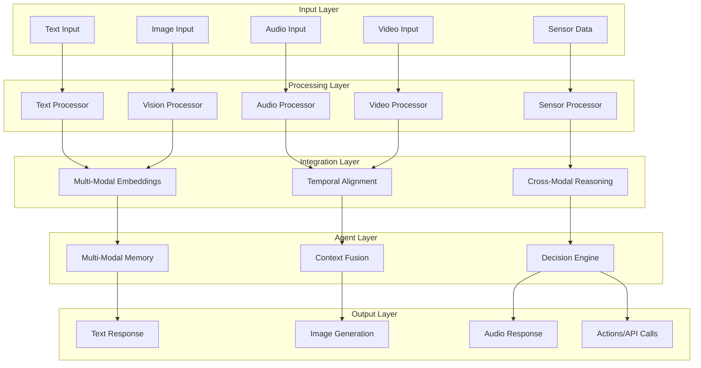

# Part II: Multi-Modal Integration

Welcome to **Part II: Multi-Modal Integration**, where you'll transform your agents from text-only systems into sophisticated multi-modal intelligences capable of processing images, audio, video, and sensor data alongside natural language.

## The Multi-Modal Revolution

Traditional AI agents operated in a single modality—typically text. But the real world is inherently multi-modal. Humans communicate through speech, gestures, facial expressions, and images. Documents contain charts, diagrams, and photos. Real-time applications need to process video streams, audio calls, and sensor data.

Part II teaches you to build agents that understand and interact with the world through all these channels simultaneously.

## What You'll Learn in Part II

### [Chapter 4: Multi-Modal Data Pipelines](./chapter4)

**Building the Foundation for Multi-Modal Intelligence**

- Design unified data ingestion pipelines that handle text, images, audio, and video
- Implement document loaders for complex formats (PDFs with images, audio transcriptions)
- Master embedding strategies that work across modalities
- Build temporal alignment systems for streaming data
- Create robust data processing pipelines that scale

**Key Outcomes:**

- Process complex documents with embedded images and charts
- Build real-time data pipelines for streaming multi-modal content
- Implement cross-modal search and similarity matching
- Handle temporal synchronization between audio, video, and text

### [Chapter 5: Computer Vision Integration](./chapter5)

**Adding Eyes to Your Agents**

- Integrate state-of-the-art vision models (GPT-4V, CLIP, LLaVA)
- Implement image understanding for classification, object detection, and scene analysis
- Build OCR systems that extract text from images and documents
- Create vision-language workflows for image description and analysis
- Process real-time video streams for dynamic applications

**Key Outcomes:**

- Build agents that can "see" and understand visual content
- Implement medical image analysis systems
- Create visual document processing workflows
- Build real-time video monitoring and analysis systems

### [Chapter 6: Audio Processing and Voice Integration](./chapter6)

**Giving Your Agents a Voice**

- Integrate speech recognition systems (Whisper, Azure Speech, AssemblyAI)
- Extract emotional context from voice prosody, pitch, and pacing
- Build voice-first agent interfaces with natural conversation flow
- Implement real-time audio stream processing
- Create multi-lingual voice support with translation capabilities

**Key Outcomes:**

- Build conversational agents that understand emotional context
- Create voice-enabled telemedicine consultation systems
- Implement real-time audio analysis for emergency response
- Build multi-lingual voice assistants

## Part II Case Study: Multi-Modal Telemedicine Agent

Throughout Part II, you'll build a comprehensive **Multi-Modal Telemedicine Agent** that demonstrates the full power of integrated multi-modal processing:

### Chapter 4 Milestone: Data Pipeline

- Ingest patient data from multiple sources (text, images, sensor data)
- Process medical documents with embedded charts and images
- Implement real-time vital sign monitoring pipeline

### Chapter 5 Milestone: Vision Integration

- Analyze wound photos for healing progress
- Extract text from prescription images and medical documents
- Implement medical imaging analysis for X-rays and scans

### Chapter 6 Milestone: Voice Integration

- Voice-to-text transcription with medical terminology
- Emotional state detection from patient voice patterns
- Multi-lingual support for diverse patient populations
- Natural voice responses with appropriate medical empathy

### Final Integration

- Unified multi-modal patient consultation system
- Real-time triage based on voice, text, image, and sensor inputs
- Automatic escalation protocols based on multi-modal risk assessment
- Complete audit trail across all modalities for compliance

## Technical Architecture Overview

The multi-modal agent architecture you'll build follows these key principles:

## Prerequisites for Part II

Before starting Part II, ensure you have:

- **Completed Part I** with solid understanding of LangChain fundamentals
- **Python libraries**: OpenCV, Pillow, librosa, ffmpeg installed
- **API access**: OpenAI GPT-4V, AssemblyAI or similar services
- **Hardware**: GPU recommended for local vision models (optional)
- **Storage**: 50GB+ for model downloads and media processing

## Performance Considerations

Multi-modal processing introduces new challenges:

| Challenge           | Solution Approach                                                  |
| ------------------- | ------------------------------------------------------------------ |
| **Latency**         | Async processing, model caching, preprocessing optimization        |
| **Storage**         | Efficient compression, cloud storage integration, cleanup policies |
| **Compute**         | GPU acceleration, model quantization, batch processing             |
| **Bandwidth**       | Stream processing, progressive loading, format optimization        |
| **Synchronization** | Event-driven architecture, message queues, temporal alignment      |

## Real-World Applications

Part II prepares you to build agents for:

- **Healthcare**: Multi-modal patient monitoring and consultation
- **Education**: Interactive learning with visual and audio content
- **Security**: Real-time surveillance and threat detection
- **Retail**: Visual product search and voice-enabled shopping
- **Manufacturing**: Quality control with vision and sensor integration
- **Media**: Content analysis and automated editing workflows

## What's Next

After completing Part II, you'll understand how to build agents that perceive and interact with the world through multiple senses. In **Part III: Context and Memory**, you'll learn to make these multi-modal agents remember, learn, and adapt their behavior over time.

---

## Navigation

- **[← Part I: Foundations](../part1-foundations)**
- **[Chapter 4: Multi-Modal Data Pipelines →](./chapter4)**
- **[Table of Contents ↑](../table-of-contents)**

---

_Part II represents a major leap in agent sophistication. By the end, your agents will have eyes, ears, and the ability to process the rich, multi-modal world around them—just like humans do._
